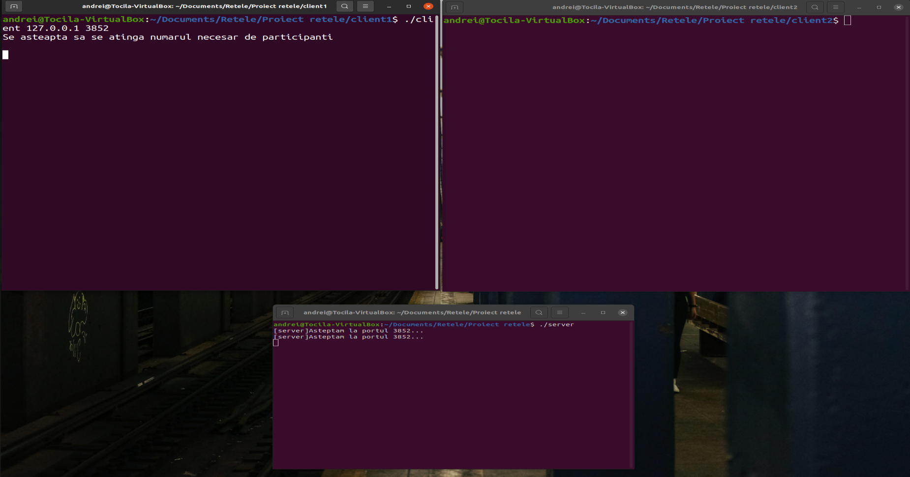
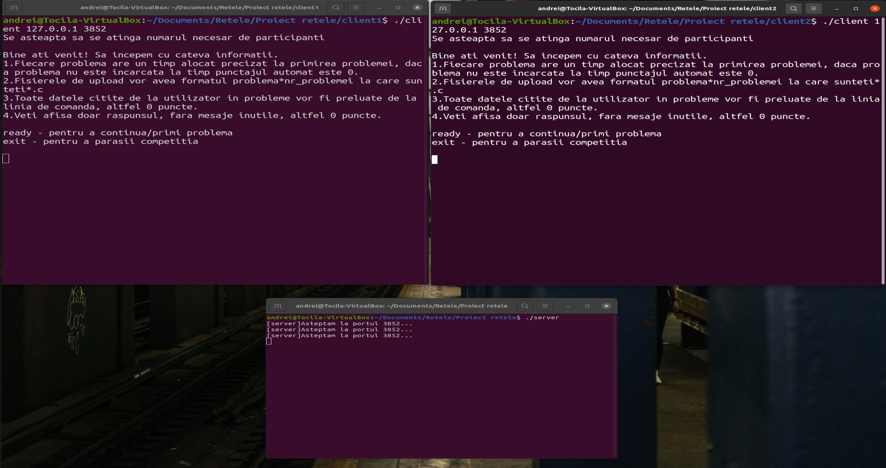
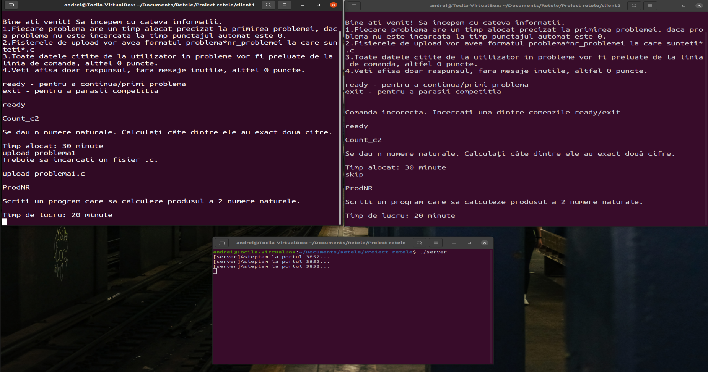
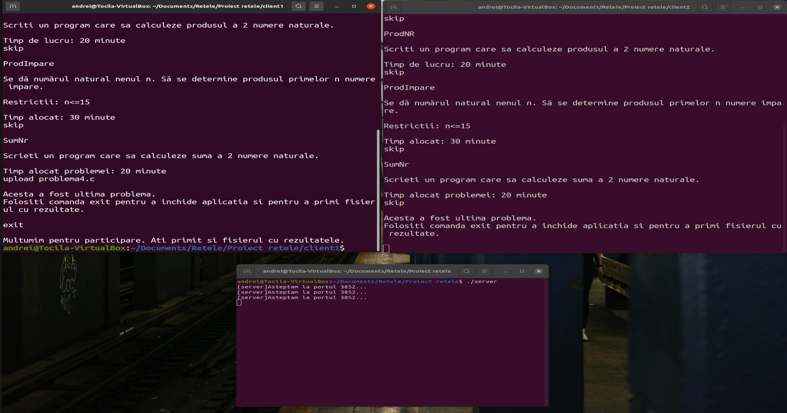

# OnlineInfoOlympiad
Final exam for "Computer Networks" course.

Compile:
* Server: ```gcc -pthread ./server.c -o server```

* Client: ```gcc -pthread ./client.c -o client```

Run:
* Server: ```./server```
* Client: ```./client 127.0.0.1 3852```









